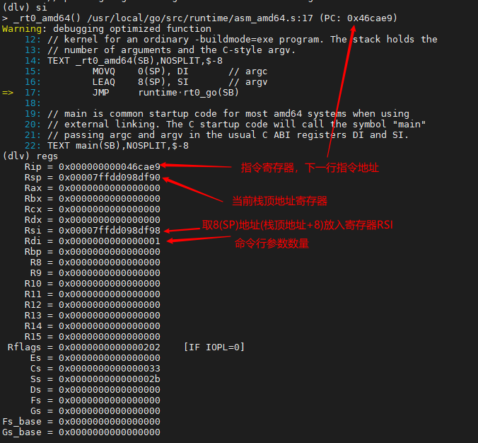
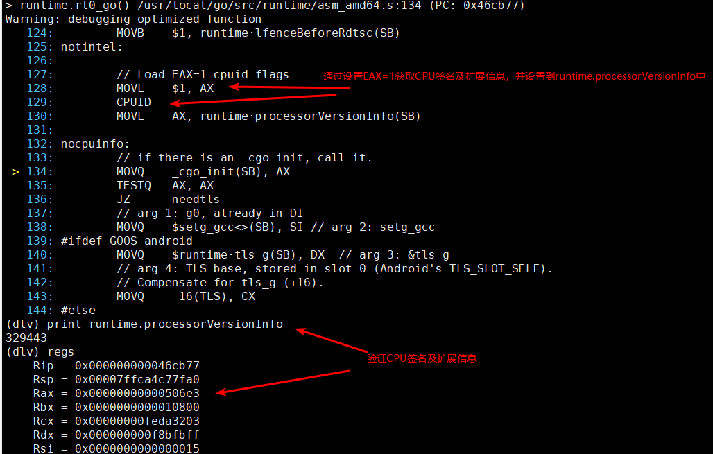

# 程序入口 #

## 代码 ##

src/startup

## dlv程序启动 ##

1. 方法一: 调试二进制程序
   ```
   go build --gcflags="all=-N -l" .
   dlv exec ./startup
   ```
   

2. 方法二: 编译程序并调试
   ```
   dlv debug .
   ```
   

## 程序入口 ##

1. 文件: `/usr/local/go/src/runtime/rt0_linux_amd64.s:8`
    

2. 通过`si`命令查看下一步执行的CPU指令, 文件: `/usr/local/go/src/runtime/asm_amd64.s:15`
    
    

3. 查看rt0_go函数逻辑, 文件: `/usr/local/go/src/runtime/asm_amd64.s:91`
    
    
    
    
    
    
    
    
